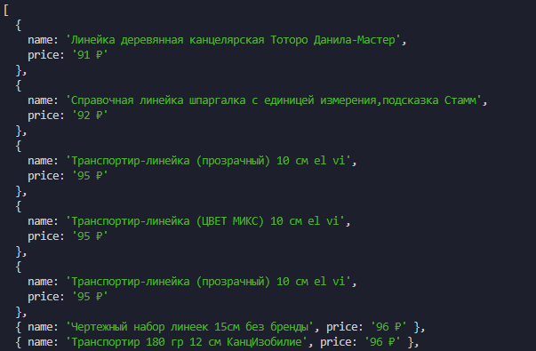

# Автотест для поиска транспортиров на Wildberries

## Описание

Этот проект представляет собой автотест, написанный с использованием фреймворка Peppeteer. Тест выполняет поиск транспортиров на сайте Wildberries, сортирует результаты по цене и выводит первые 10 элементов с их названиями и ценами.

## Требования

- node
- npm

## Установка

1. Склонируйте репозиторий
2. Выполните `npm i` для установки зависимостей
3. Запустите скрипт через `npm start`

## Результат

