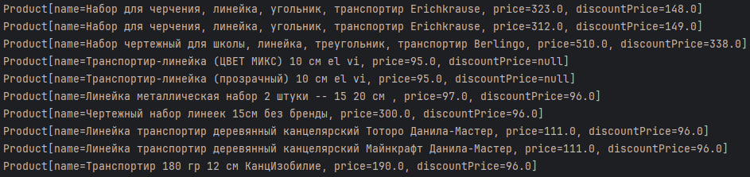

# Автотест для поиска транспортиров на Wildberries

## Описание

Этот проект представляет собой автотест, написанный с использованием библиотеки Selenide на Java. Тест выполняет поиск транспортиров на сайте Wildberries, сортирует результаты по цене и выводит первые 10 элементов с их названиями и ценами.

## Требования

- Java 8 или выше
- Maven
- IDE (например, IntelliJ IDEA)

## Установка

1. Склонируйте репозиторий
2. Выполните mvn test в корне проекта или запустите тестовый класс в InetlliJ IDEA

## Результат

