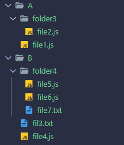

# Задача на алгоритмы

## Постановка задачи

(язык - любой на выбор. Предпочтительнее - javascript / typescript)
дано - массив путей к папкам 1-го уровня (задано в константе)
В папках находятся либо вложенные папки, либо файлы с разными расширениями.
Не бывает, чтоб в папке были одновременно и файлы и вложенные папки (то есть файлы всегда лежат на самом нижнем уровне)
надо 
●	уровень 1 (на троечку)  - сформировать массив всех путей к конечным папкам, содержащим файлы с расширением .js (если в папке есть файлы и других расширений кроме .js, такую папку берем. если в папке только файлы не .js , такие папки не берем)
●	уровень 2 (на четверку) - кроме пути к папке, также хранить кол-во файлов с расширением .js в этой папке 
●	уровень 3 (на отлично) - для заданного (в константе) числа N, полученный на шаге (1) массив подпапок разделить на N массивов, так чтобы все полученные массивы содержали более или менее одинаковое кол-во элементов.
(не обязательно находить самый оптимальный вариант с максимально равным разделением. Можно ограничиться более простым и быстрым алгоритмом, выдающим более-менее приближенные к оптимальному варианты)
пример:
структура папок на диске
A
  A1-1
    A2-1
       file1.txt
       file2.js
  A1-2
    file3.js
    file4.js
    file5.js
  A1-3
    readme.txt
B
  B1-2
     file11.js
     file12.js
     file13.js
  B1-3
     file15.js
  B1-4
     file8.js
     readme.txt	вход:
[ A, B ]
(массив с перечислением путей к корневым папкам)

N = 2
	выход (задачи 1 и 2):
●	A \ A1-1 \ A2-1  (1)
●	A \ A1-2  (3)
●	B \ B1-2 (3)
●	B \ B1-3 (1)
●	B \ B1-4 (1)

выход (задачи 3):
[1]
●	A \ A1-1 \ A2-1  (1)
●	B \ B1-2 (3)
[2]
●	A \ A1-2  (3)
●	B \ B1-3 (1)
●	B \ B1-4 (1)

## Решение

Не было явно прописано использовать объект js вместо файловой системы, или использовать ее саму. Поэтому принято решение абстрагировать от реализации через простой интерфейс `FileSystem`. Далее уже по ходу подставлять конкретную реализацию.

Основная функция - `traverse`, которая рекурсивно проходит по папкам и, если папка удовлетворяет всем следующим условиям:

1. Не содержит других подпапок
2. Нет других файлов, кроме файлов с расширением .js

добавляет путь к папке и количество файлов в массив.

Подробности в файле [findJsFolders.ts](./findJsFolders.ts).

Полученный массив делится на части по следующему алгоритму:

1. Заводится массив `chunks` длиной `N` и дополнительный массив `sums` с суммами количества файлов в папках
2. Массив `chunks` последовательно просматривается и с помощью `sums` находится подмассив с минимальным значем суммы
3. В этот массив записывается объект папки

Более детально в файле [splitIntoChunks.ts](./splitIntoChunks.ts).

Сложность по времени функции `splitIntoChunks` составляется O(N*(Количесво найденных папок)).

## Установка и запуск

1. Перейти в папку с проектом `cd typescript-task`
2. Установить зависимости `npm i`
3. Запустить на файл с задачей `npm start [taskRealFileSystem.ts|taskMockFileSystem.ts]`

## Результаты

Пусть структура файлов такова:

Тогда результат будет следующим

